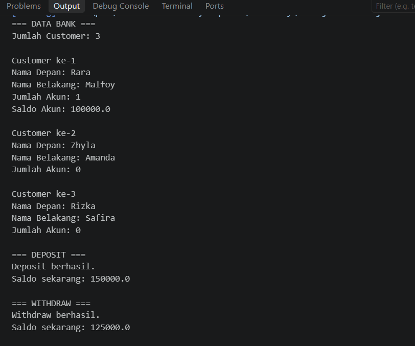

## 🐍Eksplorasi Materi Array dan ArrayList – Sistem Pengelolaan Bank🐍
☆*: .｡. o(≧▽≦)o .｡.:*☆
---
Repositori ini berisi program simulasi pengelolaan bank sederhana menggunakan bahasa pemrograman Java sebagai latihan materi Array dan ArrayList dalam Pemrograman Berorientasi Objek (Object-Oriented Programming).
---
## ⭐ Deskripsi Program ⭐
---
Program ini mengimplementasikan sistem perbankan sederhana yang terdiri dari empat class:
• Account.java: Mengelola saldo rekening melalui constructor dan method getBalance(), deposit(), serta withdraw().
• Customer.java: Menyimpan nama depan, nama belakang, dan kumpulan akun menggunakan Array dengan kapasitas maksimal 5 akun untuk setiap customer.
• Bank.java: Menyimpan dan mengelola kumpulan objek Customer menggunakan Array dengan kapasitas maksimal 10 customer.
• Main.java: Menjalankan program untuk menambahkan customer, membuat akun, menampilkan data customer dan saldo rekening, serta menguji transaksi deposit dan withdraw.
---
## 📚 Library yang Digunakan 📚
---
Program ini tidak menggunakan library tambahan. Penyimpanan data dilakukan menggunakan Array bawaan Java dengan ukuran tetap.
---
## 📸 Screenshot Output Code 📸

